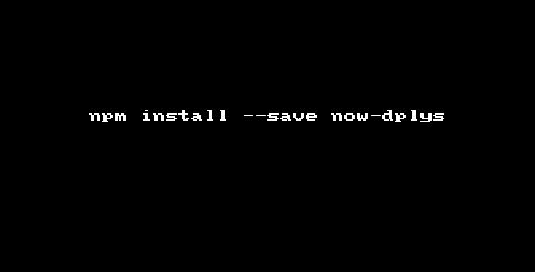

# now-dplys
> List your now deployments.



## Install

```
$ npm install --save now-dplys
```

## Usage

```js
const nowDplys = require('now-dplys');

nowDplys()
.then(dplys => {
  console.log(dplys);
})
.catch(err => {
	console.error(err)
});
```

## CLI

```
$ npm install --global now-dplys
```

```
$ now-dplys 

  Examples
    $ now-dplys
    https://now-env.now.sh
    https://nvm-now.now.sh
    https://breathe-now.now.sh
    https://cors-now.now.sh
    https://foreign-fetch.now.sh
    https://koa-rest.now.sh
    https://ws-now.now.sh
    https://sse-now.now.sh
    https://zeit-deployments.now.sh
    https://now-animatable.now.sh
```


## License

MIT © [Hemanth.HM](https://h3manth.com)
